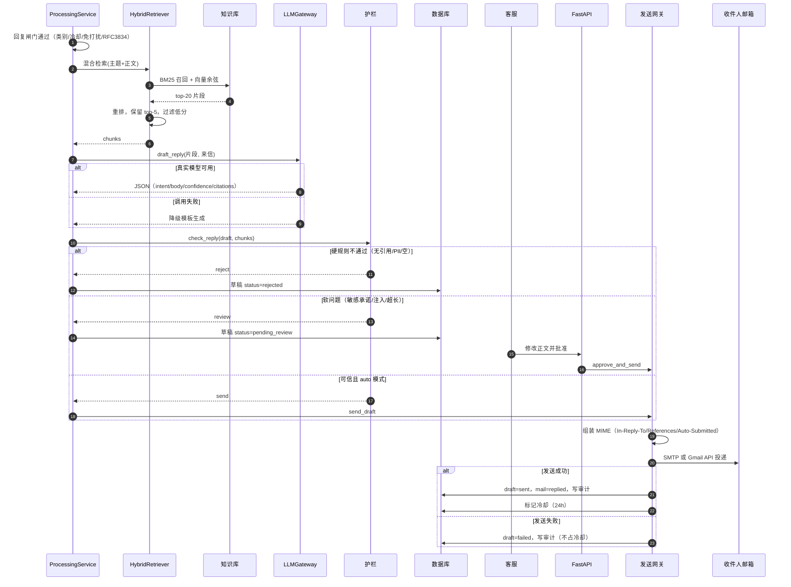

# 04 时序图：自动回复审核与发送

从"闸门通过"到"邮件真正发出"的调用链，包含人工审核与自动发送两种分支。

```mermaid
sequenceDiagram
    autonumber
    participant PROC as ProcessingService
    participant RET as HybridRetriever
    participant KB as 知识库
    participant LLM as LLMGateway
    participant GUARD as 护栏
    participant DB as 数据库
    participant OPS as 客服
    participant API as FastAPI
    participant SEND as 发送网关
    participant MAIL as 收件人邮箱

    PROC->>PROC: 回复闸门通过（类别/冷却/免打扰/RFC3834）
    PROC->>RET: 混合检索(主题+正文)
    RET->>KB: BM25 召回 + 向量余弦
    KB-->>RET: top-20 片段
    RET->>RET: 重排，保留 top-5，过滤低分
    RET-->>PROC: chunks

    PROC->>LLM: draft_reply(片段, 来信)
    alt 真实模型可用
        LLM-->>PROC: JSON（intent/body/confidence/citations）
    else 调用失败
        LLM-->>PROC: 降级模板生成
    end

    PROC->>GUARD: check_reply(draft, chunks)
    alt 硬规则不通过（无引用/PII/空）
        GUARD-->>PROC: reject
        PROC->>DB: 草稿 status=rejected
    else 软问题（敏感承诺/注入/超长）
        GUARD-->>PROC: review
        PROC->>DB: 草稿 status=pending_review
        OPS->>API: 修改正文并批准
        API->>SEND: approve_and_send
    else 可信且 auto 模式
        GUARD-->>PROC: send
        PROC->>SEND: send_draft
    end

    SEND->>SEND: 组装 MIME（In-Reply-To/References/Auto-Submitted）
    SEND->>MAIL: SMTP 或 Gmail API 投递
    alt 发送成功
        SEND->>DB: draft=sent，mail=replied，写审计
        SEND->>DB: 标记冷却（24h）
    else 发送失败
        SEND->>DB: draft=failed，写审计（不占冷却）
    end
```

**关键点**

- 闸门检查是只读的，**冷却只在发送成功后占用**；
- 生成必须有引用，否则在护栏阶段就被拒绝，不会进入人工队列；
- 审核时可改正文，差异记录在 `edited_diff`，用于统计草稿可用率；
- 自动发送与人工发送走同一条发送实现，行为一致。
